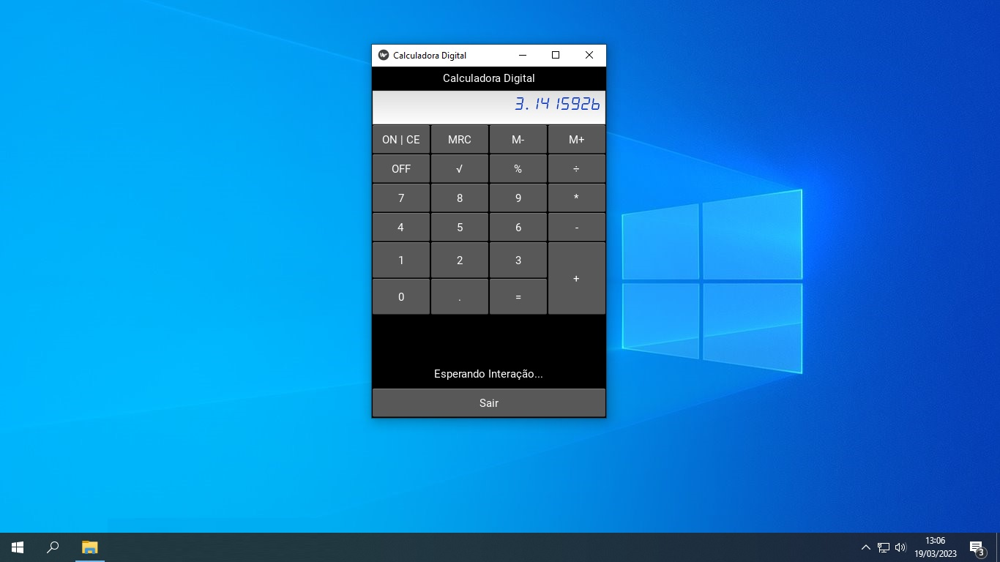

# Calculadora-Digital

Calculadora Digital com Kivy e Python3

Kivy é um framework Multiplataforma que permite o Design e Desenvolvimento de Software
que se ajusta dinâmicamente a vários e diferentes tamanhos de tela.

Vamos resolver as principais operações aritméticas com esta linda calculadora.
